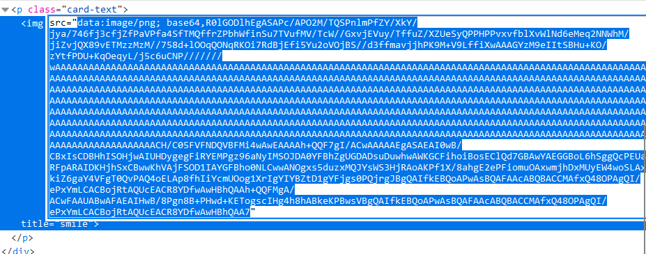
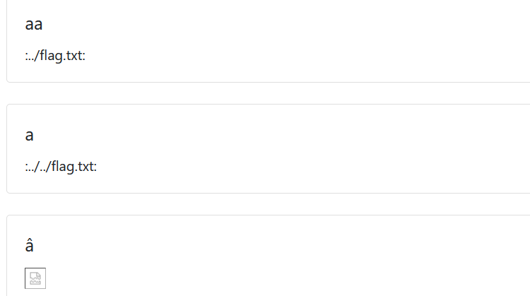
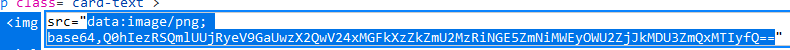

# Baby Guestbook

Bài này khi chúng ta nhập emo vào thì webserver sẽ tìm đến file chữa emo đó để hiện thị nên frontend
Sau khi thử một vài payload đơn giản thì ta thấy rằng nội dung của file chứa emo mà chúng ta submit sẽ được decode b64

Theo đề bài thì flag trong trong /flag.txt
nên ta thử các command liên quan đến file flag.txt và path traversal như *../flag.txt*, *../../flag.txt*, *../../../flag.txt*, ...
Sau một vài lần thử thì mình đã thấy được sự khác biệt của frontend trả về 

Check thử ta thấy được được một đoạn mã b64 thử decode thì lấy được flag

*Flag: CHH{4RBiTR4ry_FiL3_d0Wn10ad_6dfe634b4a9fcb1a29e6f2d057fd1122}*

