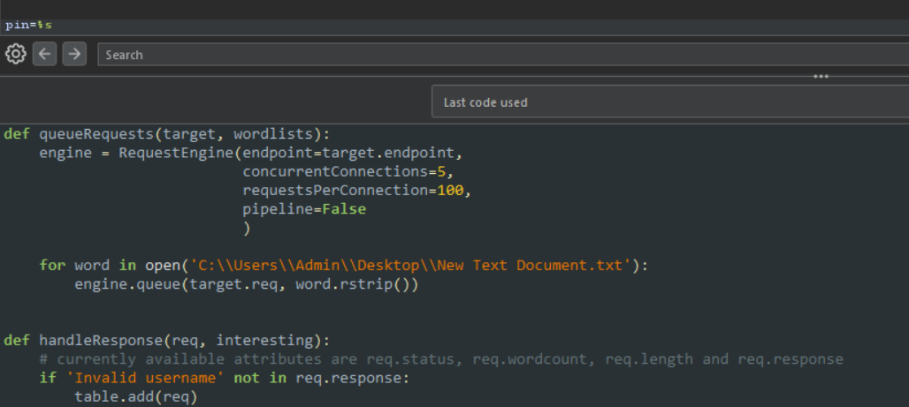

# Baby Logic Pincode

Như đề bài thì pin sẽ là một số bất kì từ 1000 đến 1500

Mình sẽ dùng burpsuite để proxy và extension turbo intruder để tìm pin
Mọi người có thể cài đặt turbo intruder trong phần Extensions > BApp Store rồi tìm tên extension
Tạo ột file chứa các số từ 1000 đến 1500
Chú ý rằng thêm ```%s``` vào vị trí tham số mà chúng ta muốn chuyền vào



Quan sát độ dài content trả về ta lấy được flag

*Flag: CHH{PincODE_Too_We@k_b636c3c6c5758638edf0446cd1526464}*