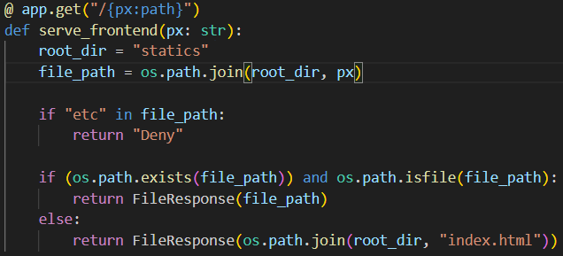
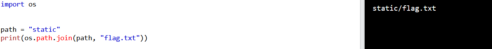
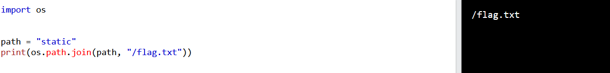

# Baby OS Path

Sau khi đọc source mình thấy có hàm xử lý GET nhận vào path



Ta thấy rằng ```root_dir = "statics"``` và flag nằm ở root directory.
Thế nhưng vì root_dir không phải là đường dẫn tuyệt đối lên khi chúng ta truyền path vào đường dẫn sẽ không dẫn đến root directory.



Sau một hồi tìm hiểu thì mình tìm được cách bypass bằng cách chuyền đường dẫn tuyệt đối của file path vào



Mình thử và lấy được flag.

*Flag: CHH{pls_ReAD_C4refully_Docs_Os_PaTH_cda1a8bf4c5bb01faf6c08d3e03b7c75}*