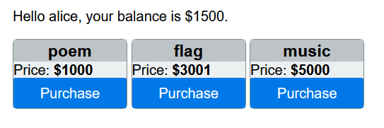
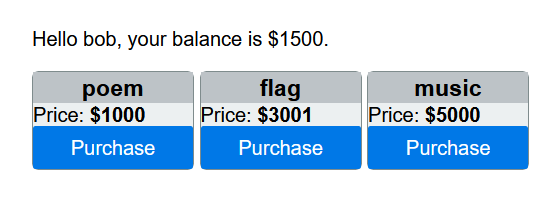
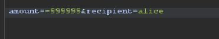

# Be Positive

Bài này cho chúng ta tên tài khoản để login vào.
Sau khi login với username:password là alice:aice ta thấy số dư tài khoản là $1500 và có các mục để mua.
Tương tự mình thử vào tài khoản bob cũng thấy có số dư là $1500.
Chúng ta thấy các chức năng ở góc trái là market, tranfer và logout.

Chúng ta cần phải có đủ $3001 để đủ mua flag tuy nhiên nếu chúng ta chuyển hết tiền của alice sang bob cũng vẫn chưa đủ

Như tên đề bài chúng là có gợi ý 'be positive'. Nếu nó không phải positive mà là negative thì sao
Mình sử dụng burpsuite để proxy thay đổi giá trị của tham số amount truyền vào băng chức năng repeater.
Mình thử trafer cho alice để bắt request và sửa lại nó thành một số âm

Sau đó quay lại market mình đã thấy sô tiền đã tăng lên rất lớn.
Lấy tiền đi mua flag thôi.

*Flag: CHH{BE_cAr3fUL_WitH_NE6ATIV3_NumBeR_7acc6248b44fc104d4c324f8eeb59308}*