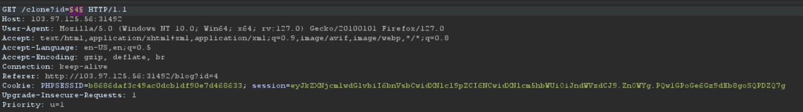
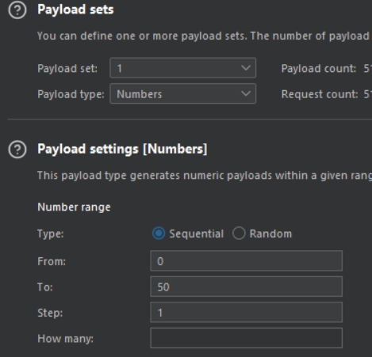

# Duplicate Content

Đăng nhập với guest:guest ta thấy có một blog có chức năng clone
Thử clone thử ta thấy web gửi GET request với path ```/clone``` theo param ```id```
Mình dùng chức năng intruder của burpsuite để bruteforce id từ 0 đến 50





Sau khi bruteforce xong xem lại các post thì thấy được flag

*Flag: CHH{DuP11C@TE_COn73nt_IdOr_cf790fef6db07ea4825965c30020eea1}*