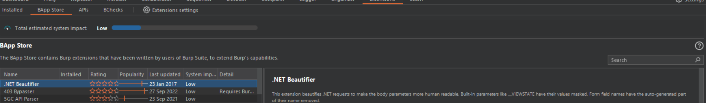
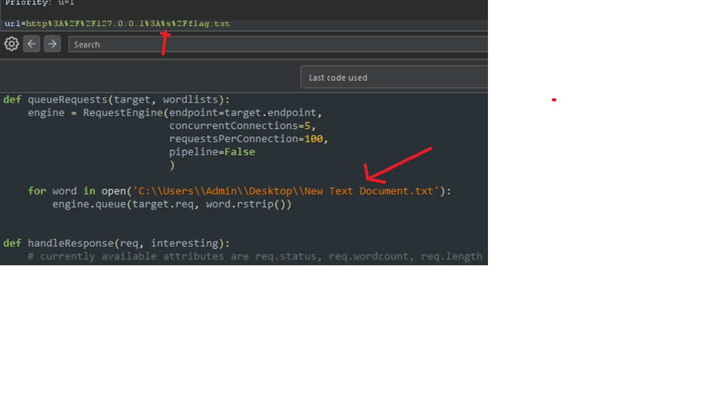
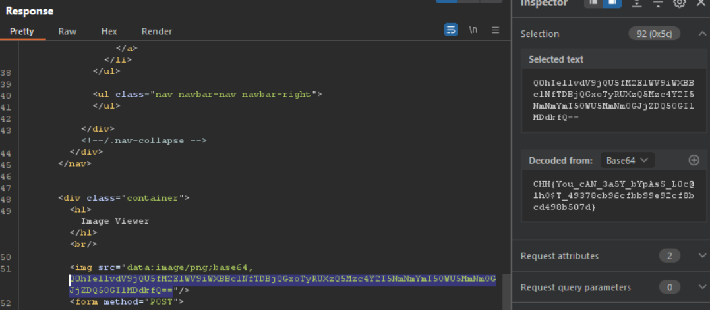

# Easy SSRF

Theo như đề bài thì 2 domain là localhost và 127.0.0.1 có trong blacklist.
Thay vì sử dụng 2 domain trên ta vẫn còn có domain nữa chỉ về địa chỉ này đó là ```fbi.com```
Số port sẽ được random trong khoảng 1500 đến 1800
Chúng ta sẽ dùng burpsuite để bắt request sau đó rẽ dùng turbo intruder để bruteforce các port
Để cài đặt turbo intruder chúng ta vào phần extensions > BAPP store rồi tìm kiếm turbo intruder



Để dùng được turbo ta cần tạo một list và thay tham số muốn chuyền vào băng kị tứ ```%s```



Quan sát words của các response ta thấy có 1 response có độ dài khác
Xem thử response đó ta thấy một đoạn base64 




*Flag: CHH{You_cAN_3a5Y_bYpAsS_L0c@lhO$T_49378cb96cfbb99e92cf8bcd498b507d}*