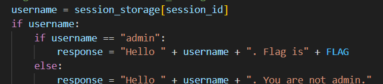
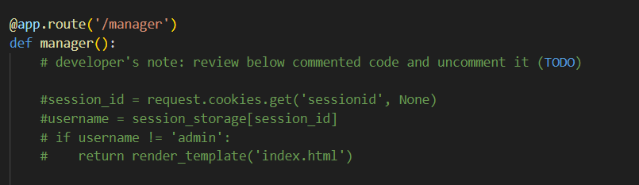

# Hello Session

Sau khi phân tích source code ta thấy rằng để đăng nhập với tài khoản admin ta cần phải có session của admin

Trong source code có cho sẵn một số username và password để đăng nhập vào
Theo như source code thì route '/manager' sẽ chữa các sesstion được lưu. Chúng ta chỉ cần vào '/manager' để lấy ra sesstion của admin

Sau đó chúng ta đăng nhập với một tài khoản bất kì mà source code cung cấp.
Inspect và vào tab Storage mục Cookie để đổi session admin là lấy được flag

*Flag: CHH{sESSIoN_SToRed_1n_SeRver_c39c9e411b712449837d2282f8868e40}*