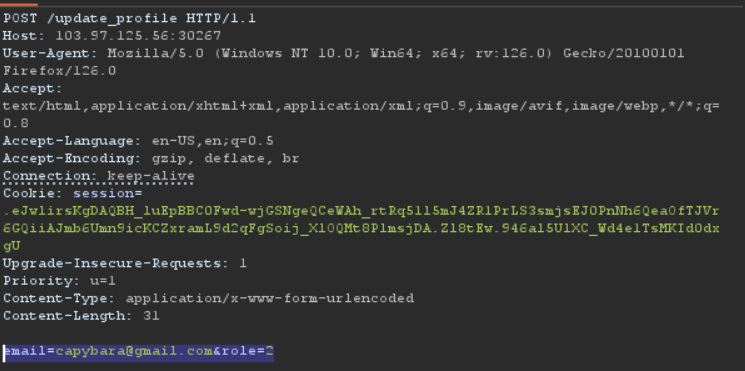

# Modify user role

Để lấy được flag ta cần set roleID = 2
Ta thử payload ```capybara@gmail.com&role=2``` nhưng đầu vào đã được validate bằng js
Thử dùng burpsuite để proxy thử và dùng repeater để sửa body của request như sau ```email=capybara@gmail.com&role=2``` 



Sau khi send request ta thử một email khác và láy được flag

*Flag: CHH{U5er_RolE_Can_BE_mod1F1ED_6abcc504b57406e849acae492fd55071}*