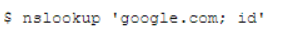

# NSLookup (Level 3)

Bài này valid date ở ngoài front end nên mình thử dùng burpsuite để sửa request

Mình thử dùng dấu ";" và lệnh "id" để test thử thì thấy full câu lệnh được thư thi ở server

Từ đây mình thử với payload là *google.com'; id'* thấy kết quả trả về cho lệnh id

Bằng google thì mình biết rằng lệnh "dir" không chỉ được dùng trên window để liệt kê file mà còn dùng được trên cả linux

mình dùng lệnh dir kết hợp với syntax ở trên để liệt kê file và tìm được flag và dùng lệnh more để đọc flag

*Flag: CHH{N5l00kupM00r3_545f63d59eb6960775c0ece7337d546a}*