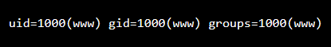

# NSLookup (Level 1)
Mình thử dùng mốt dấu ";" để kết thúc câu lệnh và kết hợp với lệnh "id" mình nhận được một số thống tin và biết được có thể khai thác bằng cách này

Từ đây biết được flag nằm ở thư trước của thư mục hiện tại. Mình dùng lệnh cat để đọc flag

Payload: *; cat ../flag.txt*
*Flag: CHH{S1mpl3C0mmandInj3ct1on_388586c5f50ea7bae8961372954f70e8}*