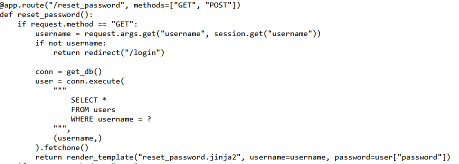

# Password Disclosure

Sau một hồi đọc source code mình phát hiện ra để đọc được flag mình cần đăng nhập với quyền admin
Không chỉ vậy khi chúng ta ta vào trang /reset_password theo phương thức GET với param username thì server sẽ tạo kết nối với database và đọc ra password của username đó



Mình thử payload là ```http://103.97.125.56:30891/reset_password?username=admin``` sau đó inspect ô input thì lấy được value chính là password của admin thì lấy được flag

*Flag: CHH{pAsSwOrD_DISC10suRe_20d0a60712c005ad1cb153d64b7a6d03}*