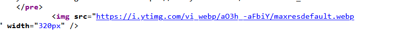
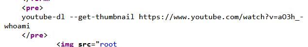

# Youtube Downloader

Bài này cho phép ta tải lên một video youtube rồi nó sẽ crawl lại thumbnail
Xem thử source code thì thấy source của file thumbnail



Mình thử payload như sau ```{link youtube}%0Awhoami``` tương tương với ```{link youtube}\nwhoami```
Ta nhận được kết quả trả về là ```/root``` nên bài này có thể injection 1 os command



Mình thử payload ```{link youtube}%0Acat%20%2Fflag.txt``` và lấy được flag.
*Flag: CHH{Ea5y_cOmmaND_inj3c7Ion_72067a9852541e5958f847a992c012c3}* 