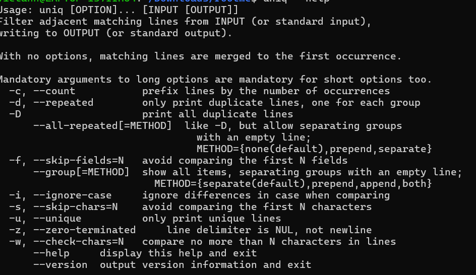
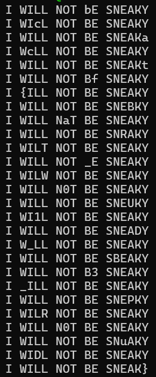

# Chalkboard Gag

Sau khi mở file mình thấy có rất nhiều từ bị lặp lại. Mình nghĩ đến việc rất có thể flag chính là những ký tự khác nhau.
Mình nghĩ đến lệnh uniq trong linux.



uniq có một option là ```-u``` chỉ liệt kê ra các dòng có ký tự khác nhau.



Theo từng dòng ta tìm được các kí tự khác nhau. Ghép lại lấy được flag.

*Flag: bcactf{BaRT_W0U1D_B3_PR0uD}*