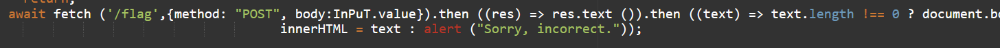

# Phone number

Mình thử check source thì thấy có một đoạn coded js
Mình dùng ```https://www.onlinegdb.com/``` để beautyfy lại code cho dễ đọc hơn.
Phân tích source code ta thấy rằng khi giá trị nhập vào là '123456789' thì xúc xắc sẽ reset về 1 
khi xúc xắc reset về 1 thì input.value mà chúng ta nhập vào sẽ bị xóa
Đọc tiếp đến route '/flag' được gửi đi theo giao thức POST.
Response sẽ trả về cho chúng ta flag nếu như chiều dài của response body khác 0 



Mình thử payload là ```1234567890``` và lấy được flag

*Flag: bcactf{PHoN3_num8eR_EntER3D!_17847928}*


