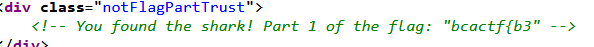

# Sea Scavenger

Thử kiểm tra source code ta thấy có các route thử truy cập vào từng cái
Ở route */shark ta* tìm được phần đầu tiên của flag



```Part 1: bcactf{b3```

Ở route */squid* ta thấy có một file js có tên */static/squid.js*. Vào thử ta lấy được part 2.


```Part 2: t_y0u_d1```

Ở route */clam* ta thấy file js có tên */static/clam.js*. Vào thử ta lấy được part 3.


```Part 3: dnt_f1n```

Ở route */shipwreck* ta thấy có file js tên là */static/shipwreck* hint là kiểm ra response headers.
Mình dùng burpsuite để proxy và đọc response header ta lấy được part 4.


```Part 4: d_th3_tr```

Ở route */whale* ta thấy file js có tên là */static/whale.js*. Vào thì thấy part 5.


```Part 5: e4sur3```

Ở route */treasure* ta thấy file js có tên là */static/treasure.js*. Vào thì thấy hint robots.txt
Truy cập vào đường dẫn ```http://challs.bcactf.com:31314/treasure/robots.txt``` ta lấy đựợc part 6.


```Part 6: _t336e3}```

*Flag: bcactf{b3t_y0u_d1dnt_f1nd_th3_tre4sur3_t336e3}*
