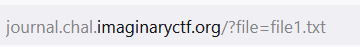
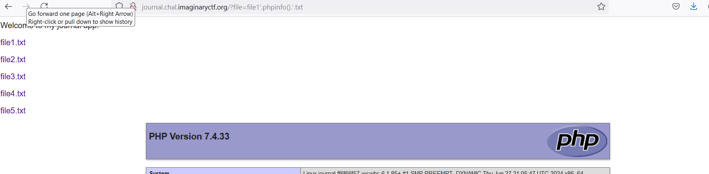
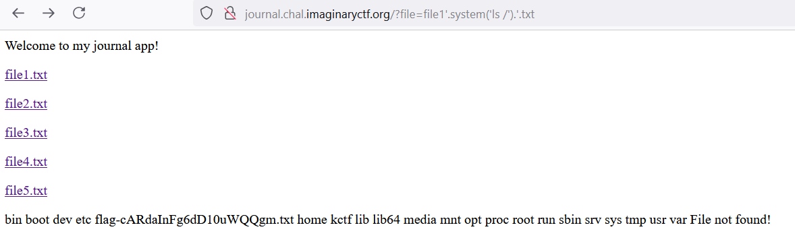

# journal 

Nhìn sơ qua chúng ta thấy rằng khi chọn file tên file sẽ trở thành tham số chuyền vào biến file. 



Nếu file không tồn tại sẽ in ra không tồn tại.

Trong Dockerfile ta thấy file flag.txt đã được đổi đên thành flag cộng với một chuỗi kí tự

Tuy nhiên trong source code có sử dụng hàm assert(). Bằng vài đường google thì mình biết được mình có thể chèn các hàm xử lí vào tên file để bypass. 

Mình thử với payload: ```file1'.phpinfo().'.txt```




kết quả trả về chứng mình rằng mình có thể inject code php với format như payload trên

Mình sẽ kiểm tra các thư mục trong root dir với payload: ```file1.'system('ls /').'.txt```



Đã tìm thấy file chưá flag rồi mình mở lên và đọc thôi, payload: ```file1'.system('cat /ten-file').'.txt


*Flag: ictf{assertion_failed_e3106922feb13b10}*