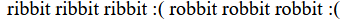
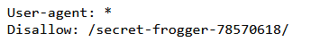

# web/frog
Nhìn vào nội dung của trang web thì mình liên tưởng đến file robots.txt nên vào xem thử

Sau khi truy cập vào file robots.txt thì mình thấy được một đường dẫn mới

Sau khi truy cập theo đường dẫn mới tìm được ta thấy được web mới. Thử xem source code ta lấy được file chứa flag

*Flag: tjctf{fr0gg3r_1_h4rdly_kn0w_h3r_3e1c574f}*

***