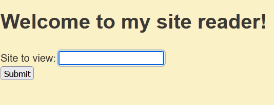

# web/reader

Điều đầu tiên mình để ý là bài này cho phép mình tải lên 1 url. Do đó rất có thể đây là vuln SSRF.

Mình thử xem source code thì khi mình truy câp vào *localhost* hoặc *127.0.0.1* và có path param là */monitor*. Xem thử Dockerfile thì mình phát hiện ra chall này chạy ở port 5000.
Mình thử payload như sau *http://localhost:5000/monitor* và lấy được flag.

*Flag: tjctf{maybe_dont_make_random_server_side_requests_dd695b62}*