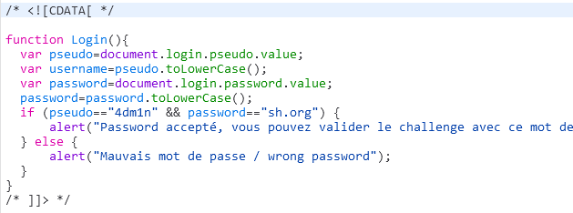

# Javascript - Authentication

Mình thử xem source code thì thấy khi mình ấn nút loggin thì atr sẽ gõi đến hàm Login() nhưng mình không thấy hàm Login() đâu
Mình thử inspect trang web mở tab network rồi nhập lại url thì thấy có một file login.js được trả về trong response.
Vào xem thử thì lấy được uername và password

Đăng nhập vào mình lấy được flag

*Flag: sh.org*