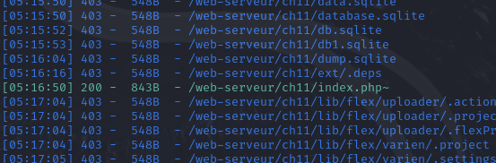

# Backup file

Mình dùng dirsearch để xem tất cả route và mình thấy được một route có status là 200



Theo mình được biết thì thường các web được viêt bằng php sẽ có file backup là index.php~
Mở file tải về thì mình lấy được username và password
```
$username="ch11";
$password="OCCY9AcNm1tj";
```
Login và lấy flag thôi

*Flag: OCCY9AcNm1tj*

