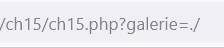
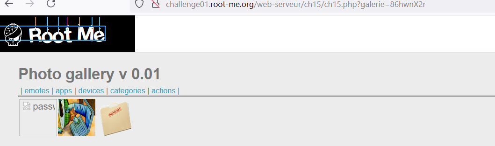

# Directory traversal

Quan sát đường dẫn kết hợp với đề bài ta thấy đây có thể là lỗi path traversal.

Quan sát source code ta thấy ảnh sẽ được hiển thị trong thẻ href.

Thử đổi tham số thành ```./```. 



Ta thấy response trả về không còn là các ảnh nữa mà là các dir . Ta thấy có 1 dur được đặt tên khác. Xem thử thì thấy được trong này có chứa file password.



Mở file lên và lấy flag thôi.

*Flag: kcb$!Bx@v4Gs9Ez*