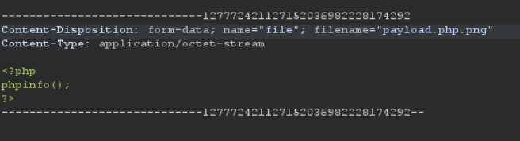
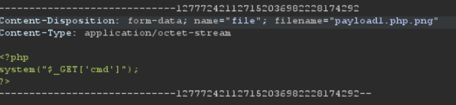
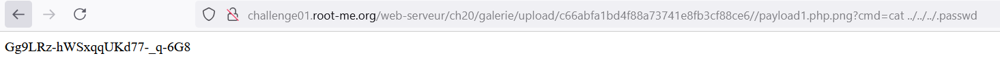

# File upload - Double extensions

Như tên đề bài thì bài này cần 2 phần mở rộng file để bypass upload. Extension chính là những phần đuôi file như .docx, .pdf, ...

Chúng ta catch request upload sau đó chuyển vào repeater trong burpsuite. Sau đó sửa lại nội dung file cũng như phần tên file.

Khi chúng ta upload thì web sẽ đọc tên file từ dưới lên nên mình để tên file và nội dung như trong hình.

Response trả về upload thành công. Vào kiểm tra thử ta thấy server đã thực hiện đoạn code php.

Mình thử truy cập trực tiếp vào /root để đọc file .passwd nhưng không được. Vì vậy mình thử dùng relative path để đọc file .passwd

Mình sửa request như sau:

Mình sẽ nhận vào tham số theo phương thức GET từ đó thay đổi đường dẫn đến file .passwd và lấy được password

*Flag: Gg9LRz-hWSxqqUKd77-_q-6G8*

