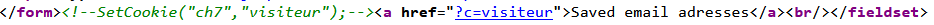

# HTTP - Cookies

Thử check source code ta thấy được một đoạn comment



Ta thử set cookie với ```name = ch7``` và ```value = visiteur``` nhưng ko lấy được flag
Ta thấy một đoạn text hiện ra thông báo rằng chúng ta cần phải là admin nên mình set lại ```value = admin``` và lấy được flag
*Flag: ml-SYMPA*
