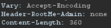
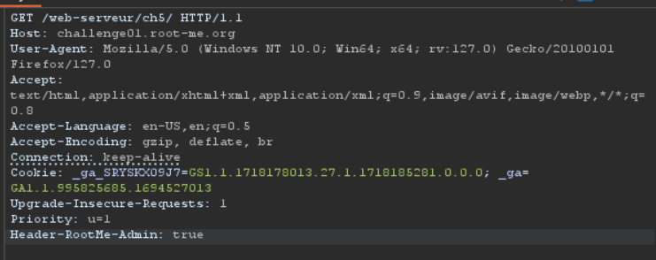

# HTTP - Headers

Như tên đề bài thì bài này có liên quan đến header của response
Mình thử dùng burpsuite để proxy và quan sát header của response thấy có một trường trả về có thể khai khác

Mình thử dùng repeate để sửa trường này thành true và lấy được flag

*Flag: HeadersMayBeUseful*