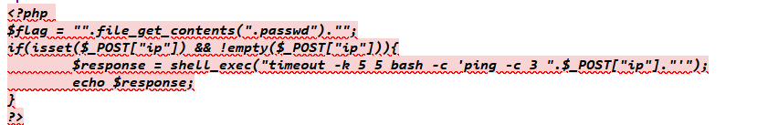

# PHP - Command injection

Như tên đề bài thì bài này có lỗi command injection
Theo như gợi ý thì flag nằm trong file index.php
Mình thử payload là ```127.0.0.1; cat index.php```
Thử xem source code thì thấy nội dung của file index.php



Biến $flag sẽ đọc nội dung file .passwd rồi trả về cho ta flag và file này nằm cùng folder với index.php
Vì vậy payload sẽ là ```127.0.0.1; cat .passwd```
Và rồi mình lấy được flag

*Flag: S3rv1ceP1n9Sup3rS3cure*